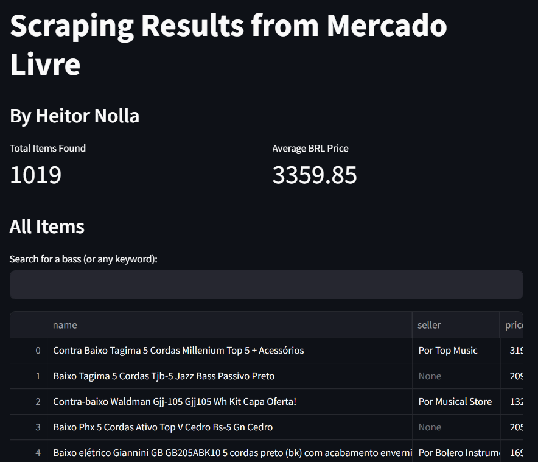

# Web Scraping Mercado Livre

**Descargo de responsabilidad:**
_Este es un proyecto personal utilizado únicamente con fines educativos/didácticos_

## Visión general

Este proyecto aprovecha la biblioteca **Scrapy** de Python para realizar web scraping en Mercado Livre, recopilando específicamente información sobre **bajos de 5 cuerdas**.

## Adaptar a otros artículos

¡Si deseas recopilar datos de otro artículo, es totalmente posible!

### Configuración rápida mediante `search_ui.py`

Ejecuta la interfaz gráfica con

```bash
python search_ui.py
```

Podrás definir la búsqueda y la cantidad de páginas que quieres rastrear (entre 1 y 20). La información queda guardada en `config.json` con una estructura como la siguiente:

```json
{
  "query": "aspiradora",
  "max_pages": 5
}
```

El valor de `max_pages` se valida automáticamente para permanecer en el rango permitido.

### 1. Ve al archivo ubicado en

```bash
extraction/spiders/mercadolivre.py
```

### 2. Update the start url

Configúrala con el artículo que deseas extraer.
Si quieres obtener precios de notebooks Acer, la URL sería

```bash
https://lista.mercadolivre.com.br/notebook-acer
```

### 3. Actualiza la función `parse`

Haz clic en el botón "Próxima página" y observa la nueva URL. Debería verse así

```bash
https://lista.mercadolivre.com.br/informatica/portateis-acessorios/notebooks/acer/notebook-acer_Desde_49_NoIndex_True
```

Define esta URL como el atributo _next page_ en la clase `MercadoLivreSpider`, pero cambia _49_ por `{offset}`.

Esto garantizará que el crawler avance a las páginas siguientes.

Al final, el código para el atributo _next page_ debería verse así

```bash
next_page = f"https://lista.mercadolivre.com.br/instrumentos-musicais/instrumentos-corda/baixos/baixo-5-cordas_Desde_{offset}_NoIndex_True_STRINGS*NUMBER_5-5"
```

### Panel de control

El panel de control actualmente se ve así:



Puedes buscar entre todos los artículos y aplicar filtros.

## Cómo instalar y ejecutar el proyecto

### Con Docker

He refactorizado el proyecto para ofrecer compatibilidad con Docker.

Puedes instalarlo con los siguientes comandos:

```bash
docker build -t mlscrape .
```

```bash
docker run -p 8501:8501 mlscrape
```

Esto asignará tu puerto 8501 al expuesto en el Dockerfile.

Podrás acceder al panel navegando a `localhost:8501`.

### Con una instalación local de Python

Es mi recomendación personal que crees un nuevo entorno virtual de Python para cada proyecto que ejecutes. Para hacerlo, abre tu terminal preferida y ejecuta los comandos

#### 1. Clona el repositorio

```bash
git clone https://github.com/heitornolla/mercadolivre-scraping.git
```

#### 2. Muévete a la carpeta del proyecto

```bash
cd mercadolivre-scraping
```

#### 3. Define la versión local de Python

```bash
pyenv local 3.12.1
```

#### 4. Crea un nuevo entorno de Python

Puedes hacerlo con `venv` mediante el comando

```bash
python -m venv .venv
```

o usar otros administradores de entornos, como Conda.

Si optaste por `venv`, activa el entorno con

```bash
source .venv/Scripts/activate
```

#### 5. Instala los requisitos

```bash
pip install -r requirements.txt
```

#### 6. ¡Ejecuta el proyecto!

Ejecuta el archivo `crawl.py` para rastrear Mercado Libre.

Para generar el panel a partir de tus datos, ejecuta

```bash
streamlit run dashboard/dashboard.py
```

## Tecnologías utilizadas

Python, Scrapy, Pandas, Streamlit y Docker
